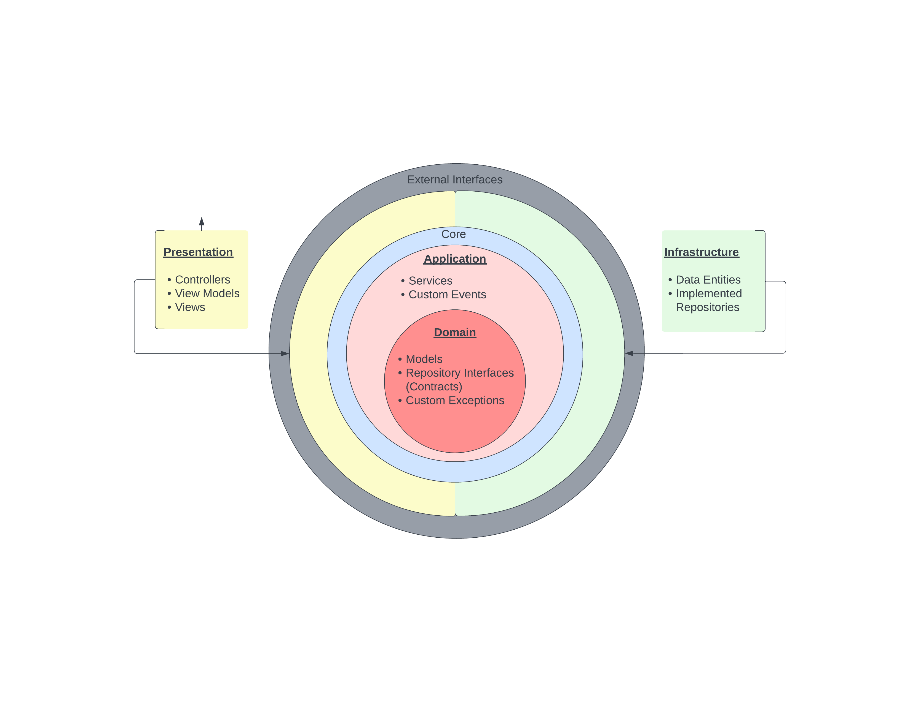
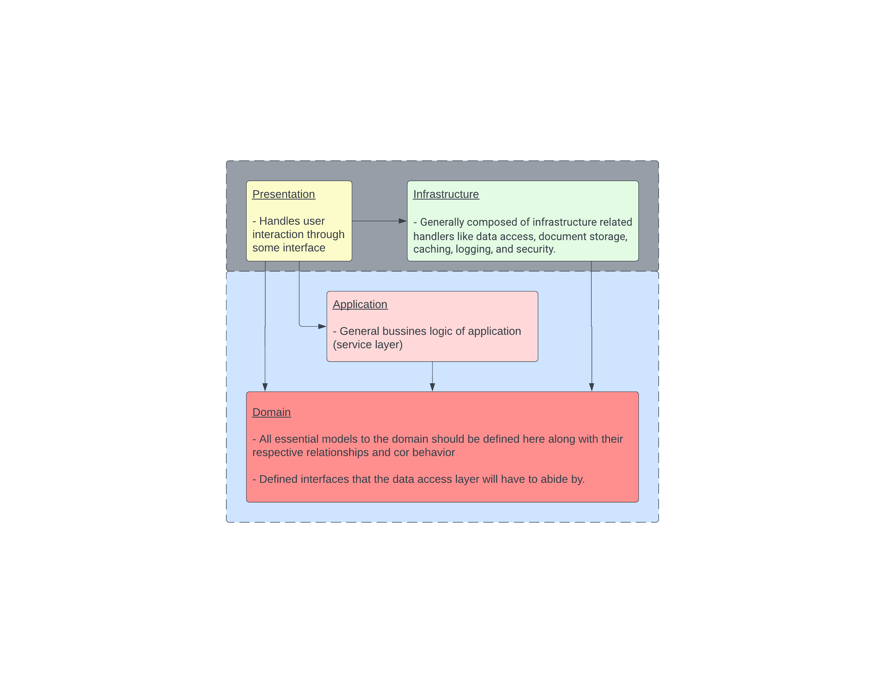
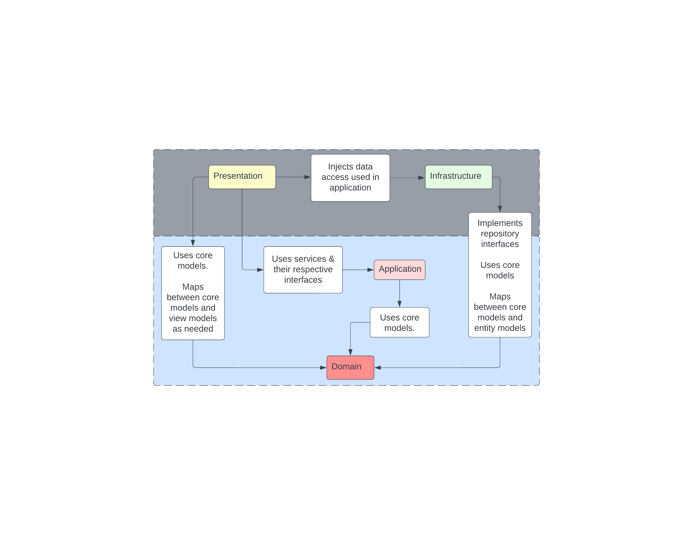

# Cinema Archive

Blah blah, description of project and general intentions of what I'd like to do

----------


Need to run
- Install node.js
- Stand up local db
    - docker instance


### Docker SQL Image
1. Download and install docker
  - https://www.docker.com/
2. Follow instructions to setup linux containers
  - https://learn.microsoft.com/en-us/windows/wsl/install-manual#step-4---download-the-linux-kernel-update-packageview=sql-server-ver16&pivots=cs1-bash
3. Follow instructions to setup the sql server container
  - https://learn.microsoft.com/en-us/sql/linux/quickstart-install-connect-docker?view=sql-server-ver16&pivots=cs1-bash

### Database
The 'DataAccess' project within the Infrastructure layer uses a code first approach to define the schema of the 'CinemaArchive' db. The entity models defined within the project dictate how the tables are ultimately structured and the creation/updating of said schema are controlled with migration scripts generated by EF Core. 

##### Create Migration to Alter Database Schema
>
```
dotnet ef migrations add [MIGRATION_NAME] --project DataAccess
```

##### Update Database From Migration
```
dotnet ef database update
```

or if you would only like to run a single migration script, use the following command

```
dotnet ef database update [MIGRATION_NAME] --project DataAccess
```


### Project Structure






